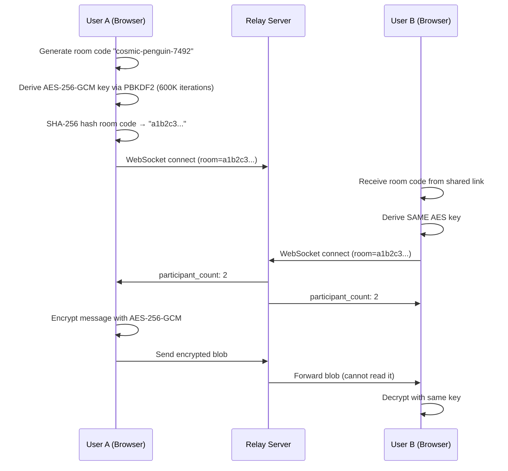

# Private Chatroom — Build Walkthrough

## What Was Built

A fully anonymous, end-to-end encrypted chatroom with zero-knowledge architecture. Three files, zero frameworks, maximum privacy.

## Project Structure

```
Private Chatroom/
├── package.json          # Only dependency: ws
├── server.js             # Zero-knowledge WebSocket relay (~128 lines)
└── public/
    └── index.html        # Complete SPA: HTML + CSS + JS (~1841 lines)
```

## Architecture



## Security Checklist — All Verified

| Check | Status |
|-------|--------|
| Room code never sent to server (URL fragment only) | ✅ |
| Server receives only SHA-256 hash as room ID | ✅ |
| All messages AES-256-GCM encrypted | ✅ |
| Unique random 12-byte IV per message | ✅ |
| PBKDF2 uses 600,000 iterations | ✅ |
| Server logs NOTHING (single startup message only) | ✅ |
| No external requests except Google Fonts | ✅ |
| No analytics, tracking, or third-party scripts | ✅ |
| Identities in sessionStorage (wiped on tab close) | ✅ |
| Server never inspects/stores/logs message content | ✅ |
| Rate limiting: 30 msg/sec per client | ✅ |
| Decryption failures silently return null | ✅ |

## Key Files

### [server.js](file:///d:/Projects/Private%20Chatroom/server.js)
- HTTP static file server (no Express)
- WebSocket relay with room routing via hashed IDs
- Rate limiting (30 msg/sec sliding window)
- Zero logging — no IPs, no messages, no metadata
- Participant count broadcasts (only server-originated message)

### [public/index.html](file:///d:/Projects/Private%20Chatroom/public/index.html)
- **Crypto Module** (lines 1096-1187): PBKDF2 key derivation, AES-256-GCM encrypt/decrypt, SHA-256 room hashing
- **Identity Module** (lines 1189-1207): Random animal emoji + color identities, sessionStorage
- **Saved Rooms** (lines 1209-1238): localStorage bookmark system like Minecraft servers
- **WebSocket Module** (lines 1474-1590): Auto-reconnect with exponential backoff
- **UI**: Three views (landing, chat, connection overlay), glassmorphism dark cyberpunk design

## Running

```bash
cd "Private Chatroom"
npm install
npm start
# → http://localhost:3000
```

## Testing

Server is running on port 3000. Open two browser tabs, create a room in one, copy the URL to the other tab, and verify encrypted messaging works. Check DevTools Network tab → WebSocket frames to confirm all messages are encrypted blobs.
